# LOAD BALANCER SOLUTION WITH NGINX AND SSL/TLS

Create an ubuntu EC2 instance with tcp port 80 and port 443 open

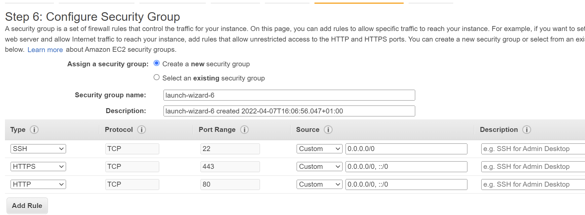

Update etc/hosts file with server names and their private IP adddress 

`sudo vi /etc/hosts`

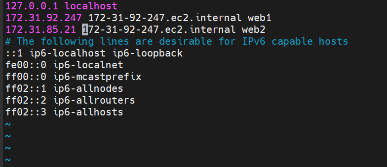

Update Ubuntu

`sudo apt update`

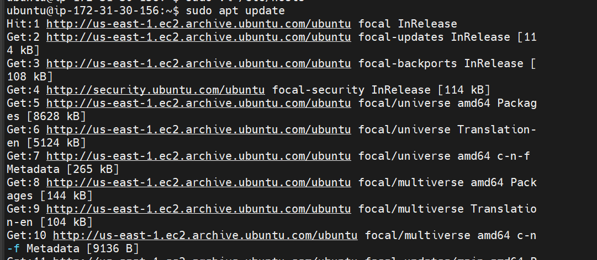

Install Nginx

`sudo apt install nginx`

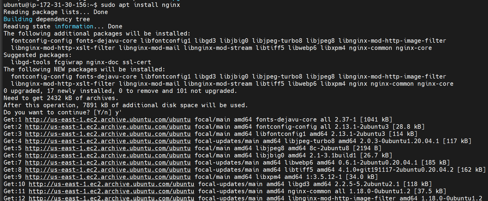

Configure Nginx using Web Servers’ names defined in /etc/hosts

`sudo vi /etc/nginx/nginx.conf`

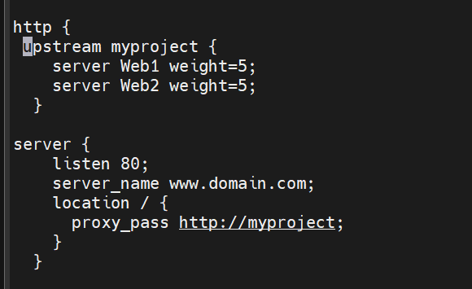

Comment out "include /etc/nginx/sites-enabled/*;"

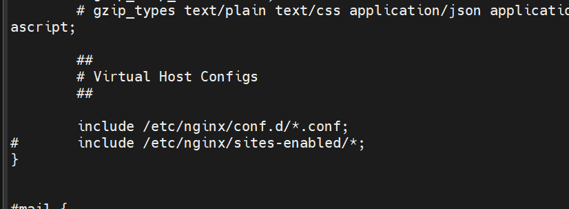

Restart Nginx

`sudo systemctl restart nginx`

Verify Nginx server is running

`sudo systemctl status nginx`

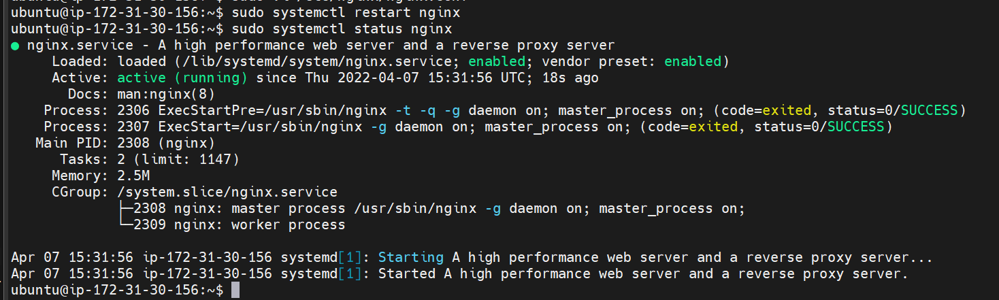

Assign an Elastic IP to your Nginx LB server 

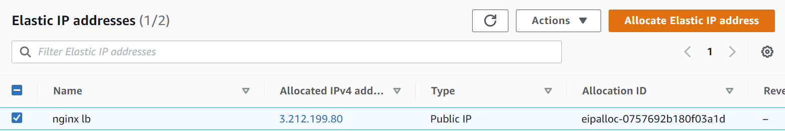

Registered a domain name ladidevops.xyz

Create a hosted zone and records for domain name

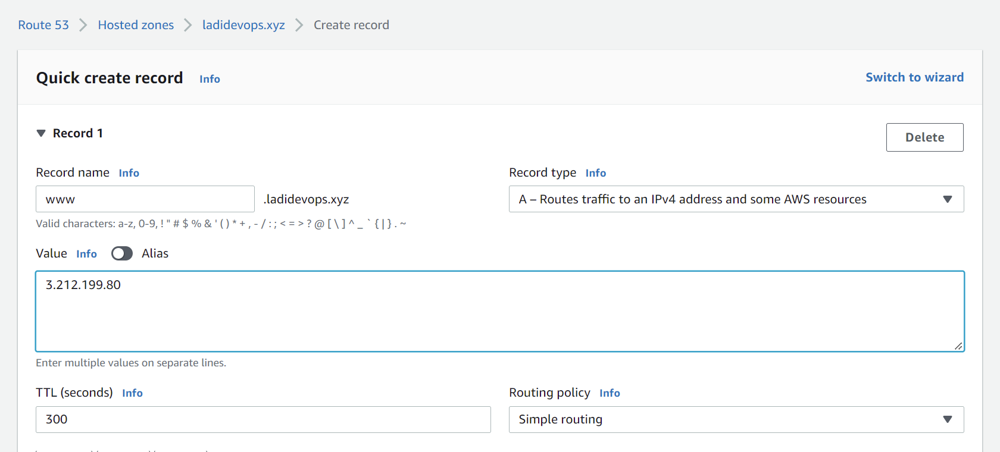

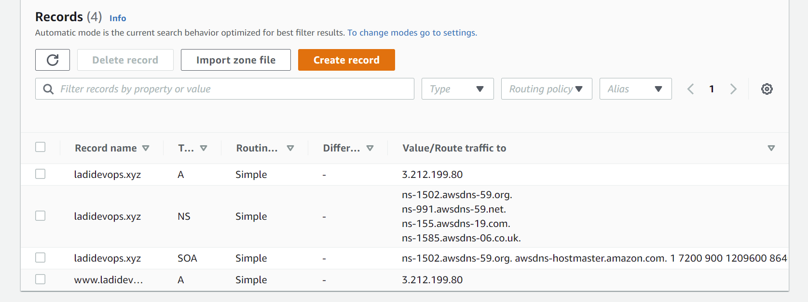

Update domain name in nginx.conf file

`sudo vi /etc/nginx/nginx.conf`

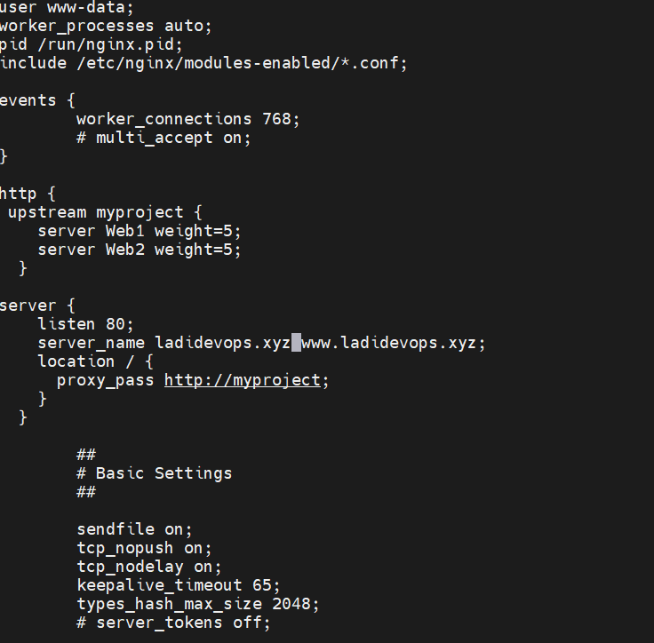

check domain name is active via web browser

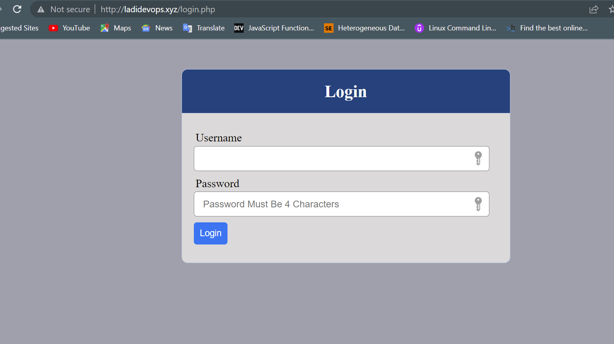

## Install certbot and request for an SSL/TLS certificate

Check if snapd service is active and running

`sudo systemctl status snapd`

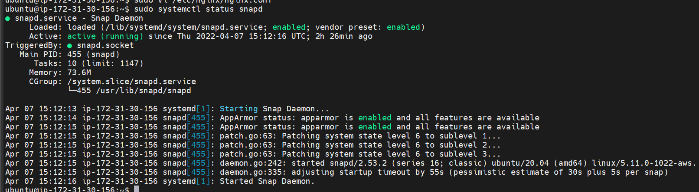

Install certbot

`sudo snap install --classic certbot`

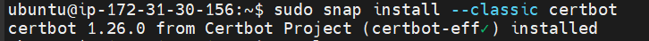

Request certificate

`sudo ln -s /snap/bin/certbot /usr/bin/certbot`

`sudo certbot --nginx`

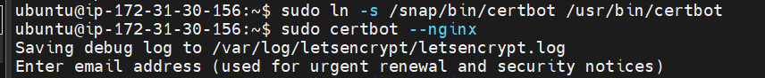

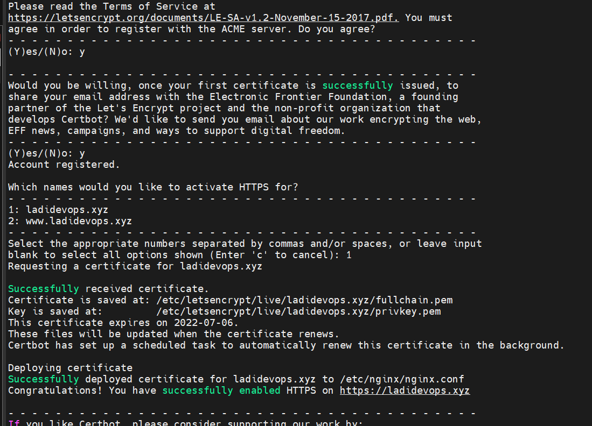

Access domain name via https

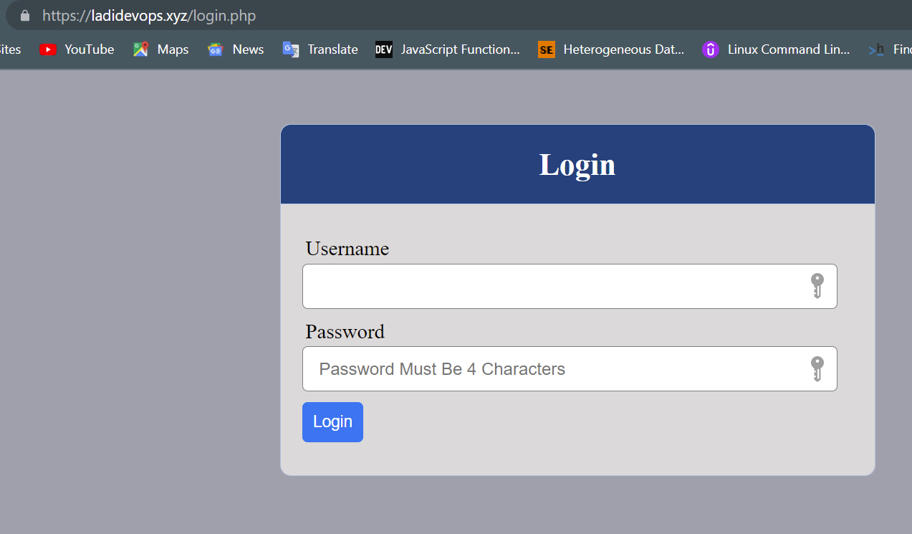

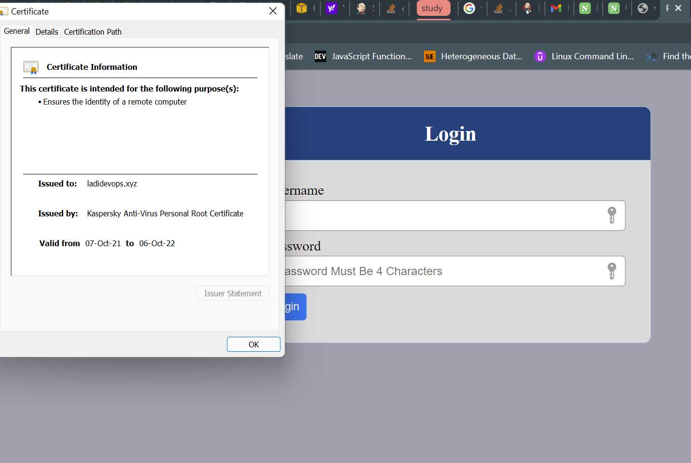

Set up periodical renewal of your SSL/TLS certificate

`sudo certbot renew --dry-run`

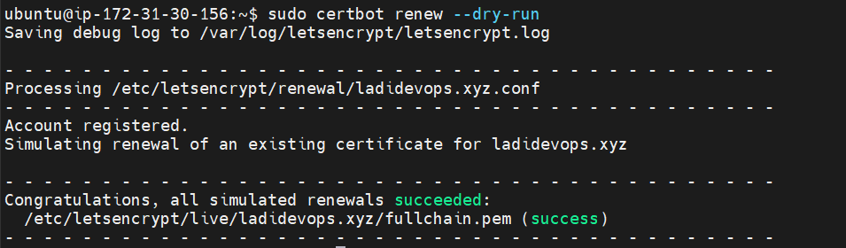

Test configure a cronjob to run the command twice a day

`crontab -e`

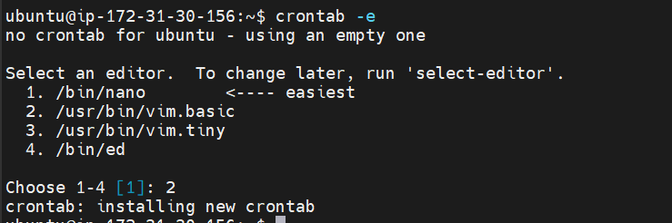

add below line

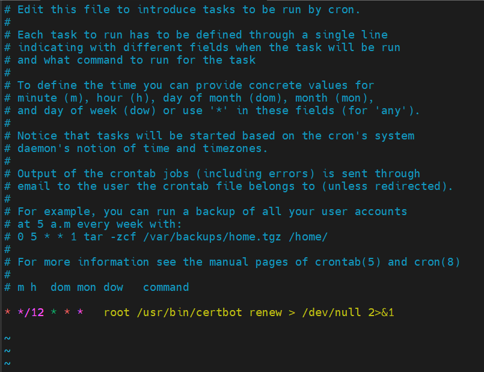
